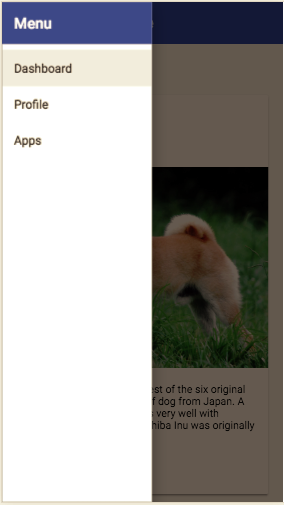
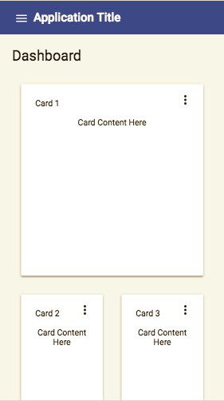
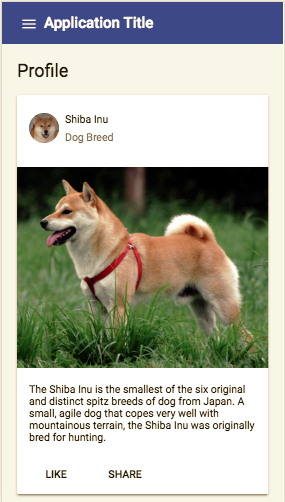
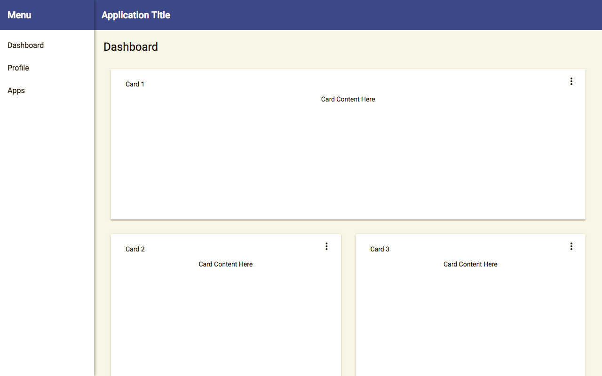

# VisFrontend

This project was generated with [Angular CLI](https://github.com/angular/angular-cli) version 6.0.8.

It include the angular material and pwa so you don't needs to setup angular material and pwa.

## Development server

Run `ng serve` for a dev server. Navigate to `http://localhost:4200/`. The app will automatically reload if you change any of the source files.

## Screens:
### Mobile:

Desktop:

## Code scaffolding

Run `ng generate component component-name` to generate a new component. You can also use `ng generate directive|pipe|service|class|guard|interface|enum|module`.

### To Add new component you can first generate module then generate component. [Read more about modularity ](https://medium.com/@cyrilletuzi/understanding-angular-modules-ngmodule-and-their-scopes-81e4ed6f7407)

*  ng g m vis-dashboard --routing
    * g -> generate
    * m -> module
    * vis-dashboard -> module name(you needs to give your module name)
    * --routing -> It will add the routing to your module

* ng generate @angular/material:material-dashboard --name=vis-dashboard

## Build

Run `ng build` to build the project. The build artifacts will be stored in the `dist/` directory. Use the `--prod` flag for a production build.

## Running unit tests

Run `ng test` to execute the unit tests via [Karma](https://karma-runner.github.io).

## Running end-to-end tests

Run `ng e2e` to execute the end-to-end tests via [Protractor](http://www.protractortest.org/).

## Further help

To get more help on the Angular CLI use `ng help` or go check out the [Angular CLI README](https://github.com/angular/angular-cli/blob/master/README.md).
